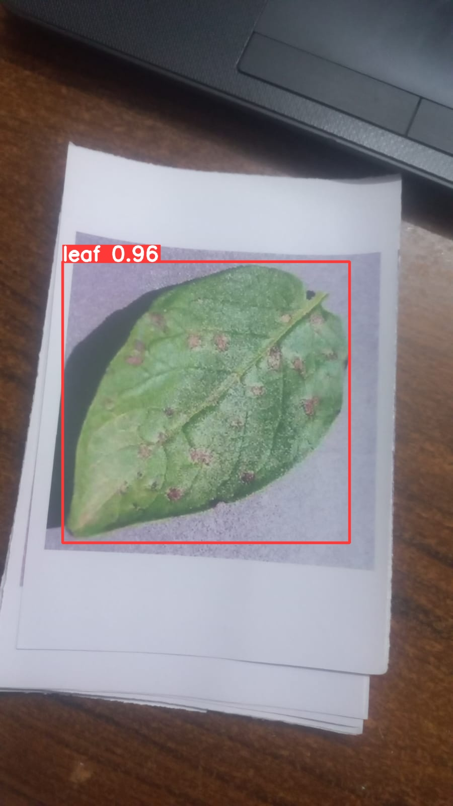
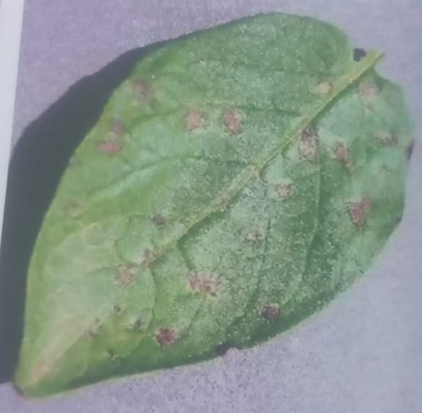

# Graduation Project

## Leaf Disease Detection and Classification Project

### Overview

This project involves detecting and classifying leaf diseases using YOLOv8 for object detection and a custom CNN model for classification. It aims to enhance the efficiency of plant disease diagnostics through automated image processing.

### Key Features

- **Accurate Leaf Detection**: Utilizes YOLOv8 to detect leaves with high precision.
- **Disease Classification**: Employs a custom CNN model to classify leaf diseases.
- **Robotic Imaging Integration**: Seamlessly integrates with robotic imaging systems for automated processing.

### Technologies Used

- **YOLOv8**
- **Custom CNN Model**
- **Python**

## Project Overview

### Sequence of Operations

1. **Robot Takes a Picture**

   The robot captures an image of the leaf. This image is then sent for processing.

     
   *Example of the image captured by the robot.*

2. **YOLO Detects the Leaf**

   YOLO (You Only Look Once) detects the leaf in the image and highlights it with bounding boxes.

     
   *Example of YOLO detecting the leaf.*

3. **Crop the Leaf**

   After detecting the leaf, the next step is to crop the leaf from the image.

     
   *Example of the cropped leaf.*

4. **CNN Model Detects Disease**

   The cropped leaf image is then sent to a CNN model to classify and detect any diseases.

## Conclusion

This project enhances plant disease diagnostics by combining advanced image processing techniques with machine learning, resulting in more efficient and accurate disease detection and classification.
